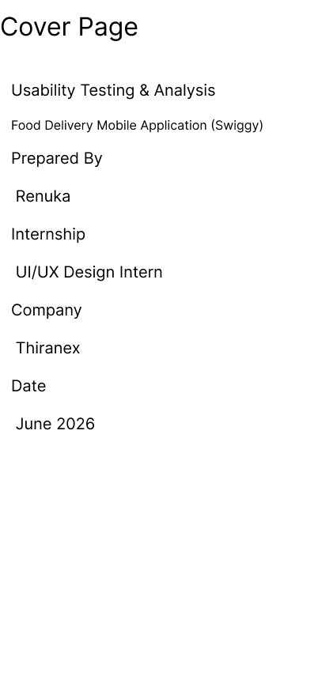
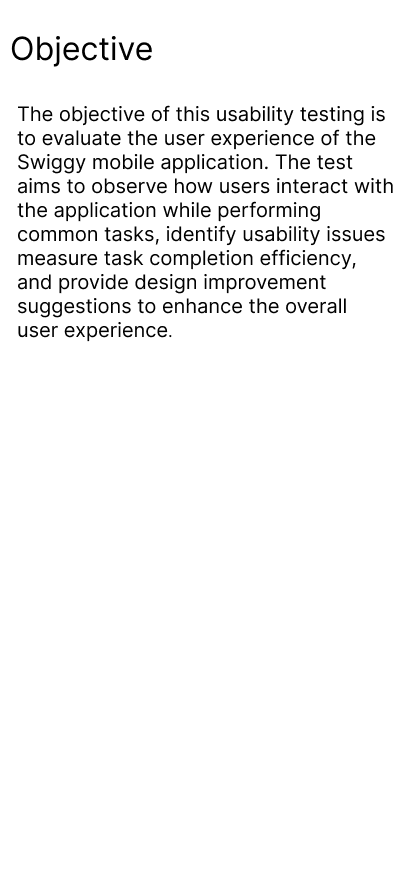
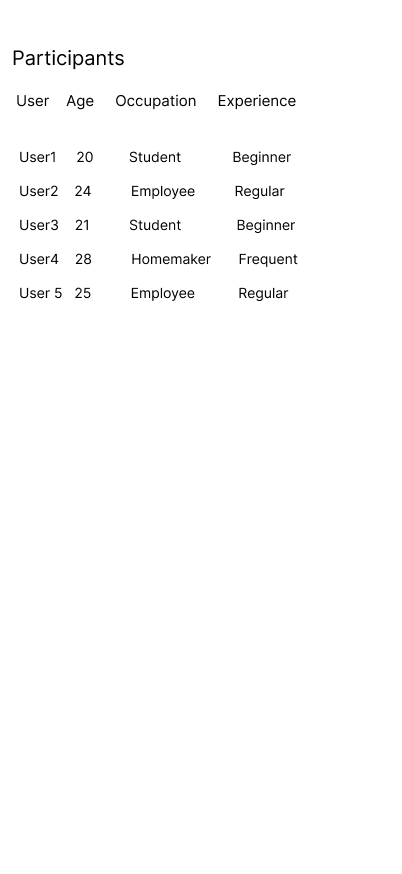
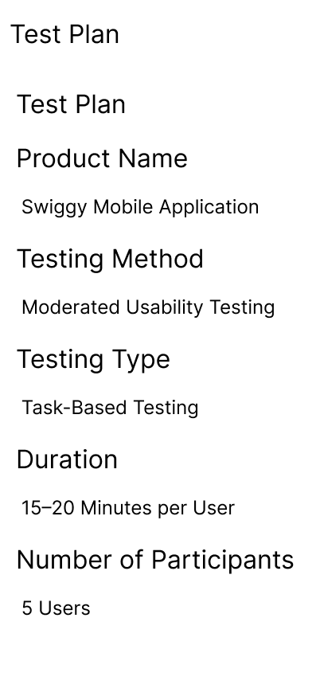
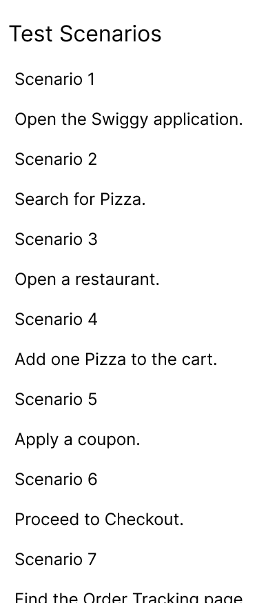
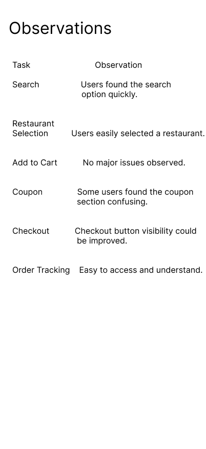
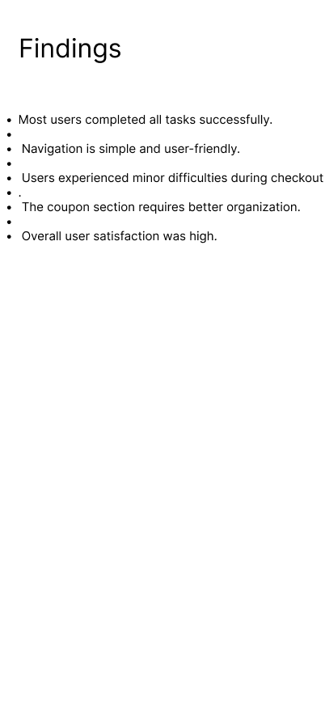
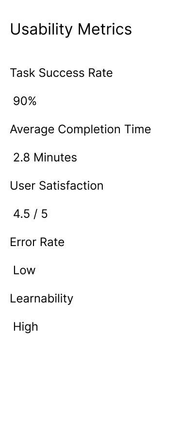
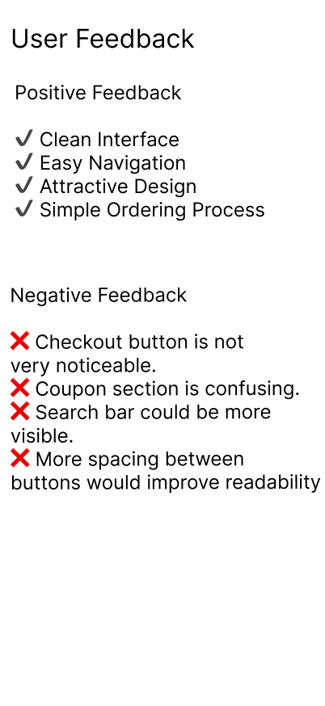
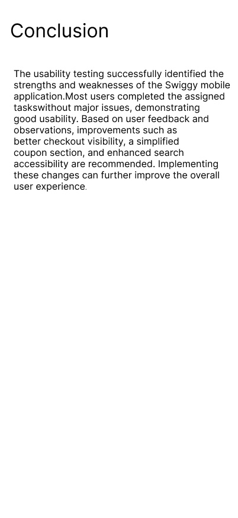

# Usability Testing & Analysis

## 📌 Project Overview
This project focuses on conducting usability testing for a digital product to evaluate its ease of use and overall user experience. The testing process involved preparing a test plan, observing users while performing specific tasks, collecting feedback, analyzing usability issues, and providing recommendations for improvement.

---

## 🎯 Objective
The objective of this project is to evaluate the usability of a food delivery mobile application by observing users while they complete common tasks. The study helps identify usability issues, measure user satisfaction, and recommend design improvements for a better user experience.

---

## 🛠️ Tools Used
- Figma
- User Observation
- Usability Testing
- UI/UX Design Principles

---

## 👥 Participants
- 5 Sample Users
- Students and Working Professionals
- Mixed experience with food delivery applications

---

## ✅ Test Scenarios
- Open the application
- Search for a restaurant
- View menu items
- Add food to the cart
- Apply a coupon
- Proceed to checkout
- Track the order

---

## 📊 Usability Metrics
- Task Success Rate
- Average Completion Time
- User Satisfaction
- Error Rate
- Learnability

---

## 🔍 Key Findings
- Most users completed the assigned tasks successfully.
- Navigation was simple and easy to understand.
- Some users found the coupon section confusing.
- The checkout button could be more visible.
- Overall user satisfaction was high.

---

## 📖 Cover

---

## 🎯 Objective

---

## 👥 Participants

---

## 📝 Test Plan

---

## ✅ Test Scenarios

---

## 👀 Observations

---

## 📊 Findings

---

## 📈 Usability Metrics

---

## 💬 User Feedback

---

## 🎉 Conclusion

## 📈 Outcome
This project improved my understanding of usability testing, user behavior analysis, usability metrics, and iterative design improvement. It also strengthened my skills in conducting usability tests, documenting findings, and presenting results in a professional UI/UX case study.

---

## 👩‍💻 Created By
**Renuka garnepudi**  
UI/UX Design Intern – Thiranex
